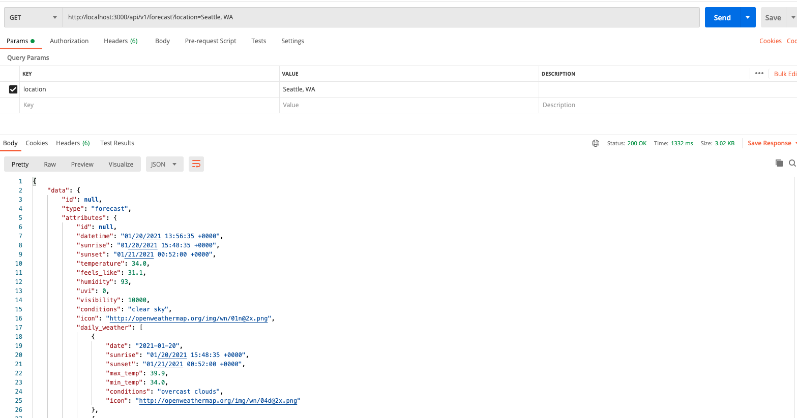
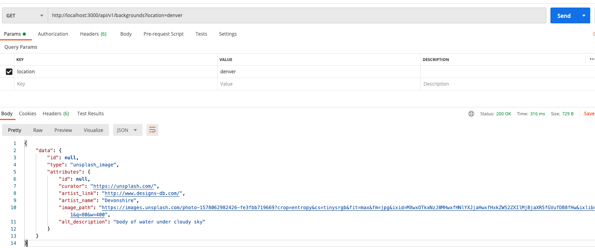
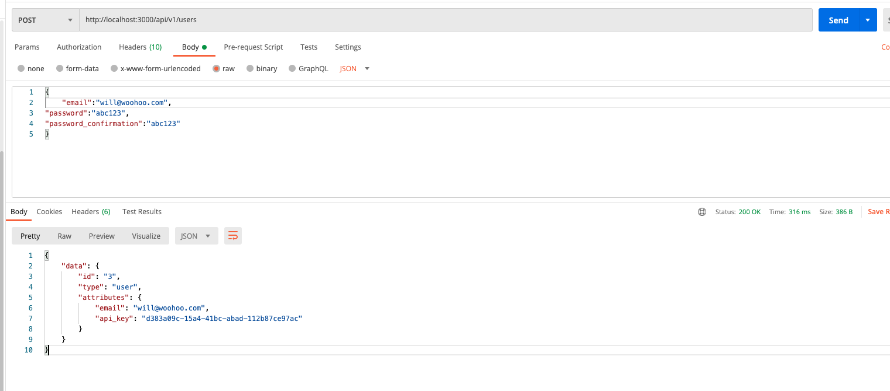
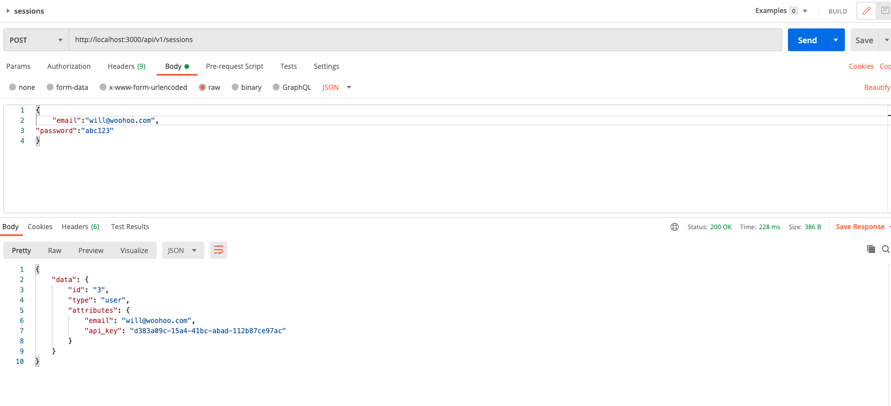
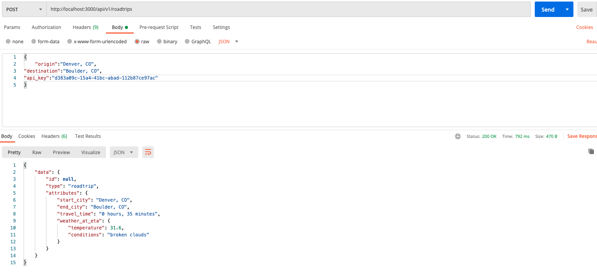

# sweater_weather
An API that exposes several endpoints for geographic, image, and weather data. It uses the MapQuest, Unsplash, and OpenWeather API's to do so.  This is a project I completed at the Turing school to achieve several learning goals:
- Expose an API that aggregates data from multiple external APIs
- Expose an API that requires an authentication token
- Expose an API for CRUD functionality
- Determine completion criteria based on the needs of other developers
- Research, select, and consume an API based on your needs as a developer

## End Points

### Forecast Endpoint
GET `api/v1/forecasts`

Allows the user to enter a city,state and it will return the forecast for the location.  It does this by first getting the coordinates from MapQuest and then using those coordinates to get the forecast from the OpenWeather API.  This endpoint returns current forecast, 8 hours of forecasted weather, and 5 days of daily weather

### Backgrounds Endpoint
GET `api/v1/backgrounds`

Allows the user to enter a city,state and it will return an image associated with the city.  It utilizes the Unsplash image search API to do so.  

### Users Endpoint
POST `api/v1/users`

This endpoint takes json stored in the body of the HTTP request and creates a new user in the system if the email is not taken and the password and password confirmation match.  It returns to the Front End a json that contains the user's email a unique API key that they can use instantiate sessions in the future.

### Sessions Endpoint
POST `api/v1/sessions`

This endpoint takes json stored in the body of the HTTP request (an email and their password) and creates a new session in the system for the user as long as they provide valid login credentials.  Like creating a new user, a successful response body is a json that contains the user's email and their API key.

### RoadTrips Endpoint
POST `api/v1/roadtrips`

This endpoint takes json stored in the body of the HTTP request (an origin and destination city/state, and their API key).  If their API key is valid, the successful response contains the origin and destination detail, expected travel time to the destination (by car), and the expected weather upon their arrival.

